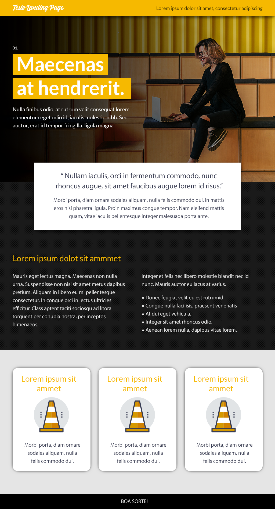

  

	
	
	

_Para a versão em Português, clique [aqui](#portuguese)._

### Topics

- [Project description](#project-description)

- [Technologies used](#technologies-used)

- [What I learned](#what-I-learned)

- [Access the Project](#access-the-project) 

 

## Project description

This page is the result of a technical test where I should follow the layout image provided below and come as close as possible to the design (without having any reference to positioning or sizes). And also add some JavaScript feature.

 

## Technologies used

  
  
  	

 

## What I learned

- Creating a central view of the layout so that, regardless of screen size, the content is always adjusted for the user to see;
- Use a vector (svg) as the image for the responsive menu icon instead of creating one with CSS, which makes the project less coded and lighter to load.

 

## Access the Project

You can [access the project here](https://caroline-barbosa-vilar.github.io/test-uol/) 

Mobile

Tablet

Desktop 

 

  

	
	
	

### Tópicos 

- [Descrição do projeto](#descrição-do-projeto)

- [Tecnologias utilizadas](#tecnologias-utilizadas)

- [O que aprendi](#o-que-aprendi)

- [Acesse o projeto](#acesse-o-projeto)

 

## Descrição do projeto 

Essa página é o resultado de um teste técnico onde eu deveria seguir a imagem de layout fornecida abaixo e chegar o mais próximo 
possível do design (sem ter nenhuma referência de posicionamento ou tamanhos) e também acrescentar alguma funcionalidade em JavaScript.

 
	
## Tecnologias utilizadas

  
  
  

 

## O que aprendi

- A criar uma visão central do layout para que, independente do tamanho da tela, o conteúdo sempre esteja ajustado para que o usuário veja;
- Utilizar um vetor (svg) como imagem para o ícone do menu responsivo ao invés de criar um com CSS, que deixa o projeto com menos código e mais leve ao carregar a página.
	
 

 ## Acesse o projeto

Você pode [acessar o projeto aqui](https://caroline-barbosa-vilar.github.io/test-uol/) 

Mobile

Tablet

Desktop 

 

Developed with 🧡 by me!  [Carol Vilar](https://www.linkedin.com/in/carolinebarbosavilar/)
